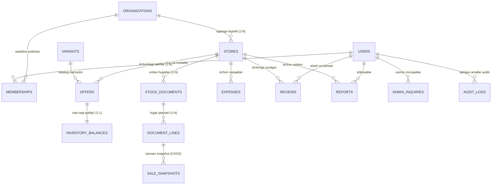

# 📊 YaqinTop Ma’lumotlar Bazasi: Arxitektura, Ishlash Mexanizmi va Optimizatsiya Qo‘llanmasi

Ushbu hujjat **YaqinTop** platformasining ma’lumotlar bazasi tuzilishi, mantiqiy modellari, moliyaviy va geofazoviy (Geospatial) algoritmlari hamda tizimni yuqori yuklamali (High-load / Production) darajaga chiqarish bo‘yicha to‘liq texnik qo‘llanmadir.

---

## 1. 🏗️ Ma’lumotlar Bazasining Relyatsion Modeli (ER Modeli)

Platformaning yadroviy ma’lumotlar bazasi 5 ta asosiy domen (Domain Group) ga bo‘lingan:



### Jadvallar va Entitylar Tavsifi:

| Model / Jadval | Vazifasi va Mantiqiy Qimmati | Asosiy Ustunlar / Xususiyatlar |
| :--- | :--- | :--- |
| **`ORGANIZATIONS`** | Yuridik shaxs, savdo tarmog‘i yoki brend egasi | `id`, `name`, `inn`, `type (RETAIL/WHOLESALE/MIXED)`, `status`, `region`, `city`, `district` |
| **`STORES`** | Jismoniy savdo nuqtasi / Filial (Xaritadagi nuqta) | `id`, `organizationId`, `name`, `address`, `phone`, `lat`, `lng`, `hours[]`, `isVerified`, `status` |
| **`USERS`** | Tizim foydalanuvchilari (Mijoz, Xodim, Moderator, Admin) | `id`, `fullName`, `email`, `phone`, `role`, `status`, `isVerified`, `verificationMethod` |
| **`MEMBERSHIPS`** | Xodimning muayyan tashkilotga biriktirilgan roli | `id`, `organizationId`, `userId`, `role (OWNER/MANAGER/OPERATOR)`, `status` |
| **`VARIANTS`** | Yagona global mahsulotlar katalogi | `id`, `title`, `barcode`, `category`, `brand`, `aliases[]`, `photoUrl` |
| **`OFFERS`** | Muayyan do‘konda tovarning sotuv narxi va vitrinasi | `id`, `storeId`, `variantId`, `price`, `minOrderQuantity`, `wholesaleTiers[]`, `freshness`, `version` |
| **`INVENTORY_BALANCES`** | Haqiqiy ombor qoldig‘i va o‘rtacha tortilgan tannarx | `offerId`, `onHand`, `averageUnitCost`, `lastVerifiedAt`, `version` |
| **`STOCK_DOCUMENTS`** | Ombor harakatlari jurnali (Kirim, Sotuv, Qaytarish) | `id`, `organizationId`, `storeId`, `docType`, `docNumber`, `status`, `lines[]` |
| **`DOCUMENT_LINES`** | Hujjat tarkibidagi tovar qatorlari | `id`, `documentId`, `variantId`, `quantity`, `unitPriceOrCost` |
| **`SALE_SNAPSHOTS`** | Sotuv lahzasidagi tannarx (COGS) muhrlanishi | `saleLineId`, `variantId`, `quantity`, `unitPrice`, `unitCostSnapshot`, `returnedQuantity` |
| **`EXPENSES`** | Filialning operatsion xarajatlari (Ijara, Maosh, Kommunal) | `id`, `organizationId`, `storeId`, `category`, `amount`, `date`, `description` |
| **`ADMIN_INQUIRIES`** | Xaridor, Do‘kon egasi va Admin/Moderator integrallashgan murojaatlari | `id`, `senderId`, `storeId`, `category`, `priority`, `status`, `message`, `merchantReply`, `adminReply` |
| **`AUDIT_LOGS`** | Muhim amallar, o‘zgarishlar va moderatsiya tarixi | `id`, `actorId`, `actorEmail`, `action`, `entityType`, `entityId`, `diff`, `timestamp` |
| **`IDEMPOTENCY_RECORDS`** | Takroriy so‘rovlarni to‘xtatish va dublikatdan himoya | `scope`, `key`, `requestHash`, `statusCode`, `responseBody`, `createdAt` |

---

## 2. ⚙️ Tizimning Ishlash Mexanizmlari

### 2.1. 📍 Giper-Lokal Qidiruv (Geospatial + Fuzzy Matching)
Xaridor tovar qidirganda tizim 3 bosqichli filtrlashdan foydalanadi:
1. **Sferik Masofa (Haversine Formula):**
   Xaridor koordinatasi ($lat_1, lng_1$) va do‘kon koordinatasi ($lat_2, lng_2$) orasidagi masofa metr hisobida aniqlanadi:
   $$d = 2R \arcsin\left(\sqrt{\sin^2\left(\frac{\Delta lat}{2}\right) + \cos(lat_1)\cos(lat_2)\sin^2\left(\frac{\Delta lng}{2}\right)}\right)$$
2. **O‘zbek Tili Matn Normalizatsiyasi:**
   Barcha apostroflar (`o'`, `g‘`, `ʻ`, `’`), lotin/kirill chalkashliklari, katta-kichik harflar va bo‘shliqlar unifikatsiya qilinadi.
3. **N-Gram / Trigram O‘xshashlik Qidiruvi:**
   - **Shtrix-kod:** Aniq mos kelsa $\rightarrow$ Score: `1.0` (Yuqori ustuvorlik)
   - **Mahsulot nomi prefiksi:** Mos kelsa $\rightarrow$ Score: `0.9`
   - **Sinonimlar lug‘ati (`CANONICAL_ALIASES`):** `snikers`, `сникерс`, `кола`, `twix` $\rightarrow$ Score: `0.85`
   - **Trigram Jaccard o‘xshashligi:** Matn bo‘yicha o‘xshashlik $\rightarrow$ Score: `0.4 - 0.8`

### 2.2. 💰 Moliyaviy va Ombor Hisob-kitobi (Weighted Average Cost & COGS)
- **Kirim (RECEIPT):**
  Ombordagi o‘rtacha tortilgan tannarx (WAC) yangilanadi:
  $$\text{Yangi Tannarx} = \frac{(\text{Eski Qoldiq} \times \text{Eski Tannarx}) + (\text{Kirim Miqdori} \times \text{Kirim Narxi})}{\text{Eski Qoldiq} + \text{Kirim Miqdori}}$$
- **Sotuv (SALE):**
  - Manfiy qoldiqqa tushib ketishdan himoyalangan (`currentQty < reqQty` bo‘lsa `409 Conflict`).
  - Har bir sotuv qatori uchun o‘sha lahzadagi tannarx `SALE_SNAPSHOTS` jadvaliga muhrlanadi.
- **Sof Foyda (Net Profit):**
  $$\text{Sof Foyda} = \text{Jami Tushum} - \text{Sotilgan Tovarlar Tannarxi (COGS)} - \text{Operatsion Xarajatlar}$$

### 2.3. 🔒 Parallelizm va Idempotentlik (Concurrency & Mutex Locks)
- **Mutex Locks (`acquireOfferLocks`):** Bir vaqtning o‘zida bir nechta kassa bir xil tovar qoldig‘ini o‘zgartirganda ma’lumot buzilmasligi uchun tovar ID lari tartiblangan ketma-ketlikda qulflanadi (Deadlock oldi olinadi).
- **Idempotency Keys:** Aloqa uzilishi sababli qayta yuborilgan kassa cheklari yoki buyurtmalar `Idempotency-Key` orqali tekshiriladi va dublikat sotuv yaratilmaydi.

---

## 3. 🚀 Ma’lumotlar Bazasini Modernizatsiya Qilish Rejasi

Hozirgi xotirada (In-Memory) ishlovchi ma’lumotlar bazasini to‘liq Production darajasiga chiqarish bosqichlari:

### 1-Qadam: PostgreSQL + PostGIS (Geofazoviy Indekslar)
Xotiradagi Haversine formulasi o‘rniga PostgreSQL dagi **PostGIS** moduli ulanadi:
```sql
-- PostGIS kengaytmasini yoqish
CREATE EXTENSION IF NOT EXISTS postgis;

-- Do'konlarga spatial ustun qo'shish va GiST indeks yaratish
ALTER TABLE stores ADD COLUMN geom GEOGRAPHY(Point, 4326);
UPDATE stores SET geom = ST_SetSRID(ST_MakePoint(lng, lat), 4326);
CREATE INDEX idx_stores_location ON stores USING GIST (geom);

-- Foydalanuvchiga 2 km radiusdagi eng yaqin do'konlarni sub-millisekundda olish
SELECT id, name, address, ST_Distance(geom, ST_SetSRID(ST_MakePoint(69.2401, 41.2995), 4326)) AS distance_m
FROM stores
WHERE ST_DWithin(geom, ST_SetSRID(ST_MakePoint(69.2401, 41.2995), 4326), 2000)
ORDER BY distance_m ASC;
```

### 2-Qadam: `pg_trgm` va Full-Text Search (Tezkor Qidiruv)
```sql
CREATE EXTENSION IF NOT EXISTS pg_trgm;

-- Mahsulot nomi va brendi uchun GIN Trigram indeksi
CREATE INDEX idx_variants_title_trgm ON variants USING GIN (title gin_trgm_ops);
CREATE INDEX idx_variants_brand_trgm ON variants USING GIN (brand gin_trgm_ops);
CREATE INDEX idx_variants_barcode ON variants (barcode);
```

### 3-Qadam: Redis Keshlash Qatlami (Cache Layer)
- **Geo-Radius Caching:** Ko‘p so‘raladigan shahar hududlari (Geohash klasterlari) bo‘yicha qidiruv natijalarini Redis da 60 soniya keshlab turish.
- **Real-time Live Sync:** Kassir tovar sotgan zahoti mijoz xaritasida qoldiq yangilanishi uchun Redis Pub/Sub va WebSocket hodisalaridan foydalanish.

### 4-Qadam: Prisma / Drizzle ORM Integratsiyasi
`packages/contracts` dagi barcha tiplarni yagona `schema.prisma` ga aylantirib, tranzaksiya izolyatsiyasi darajalarini (`READ COMMITTED` / `SERIALIZABLE`) ta’minlash.

---

## 4. ⚡ Ish Unumdorligini (Optimization) Oshirish Bo‘yicha Tavsiyalar

| Yo‘nalish | Hozirgi Holat | Optimizatsiya Qilish Usuli | Kutilayotgan Natija |
| :--- | :--- | :--- | :--- |
| **Sotuvlar hisobi (COGS)** | Har safar massiv aylanadi | `SALE_SNAPSHOTS` ustunlariga indeks va materializatsiyalashgan view (`MATERIALIZED VIEW`) qo‘shish | Moliyaviy hisobotlar 50 barobar tezlashadi |
| **Narx eskirishi (Freshness)** | So‘rov kelganda hisoblanadi | Cron Job / Background worker orqali kechasi statusni yangilab qo‘yish | Qidiruvdagi CPU yuklamasi kamayadi |
| **Audit jurnali (Audit Logs)** | Bosh DB ga yoziladi | Time-series DB (TimescaleDB / ClickHouse) yoki alohida log serverga chiqarish | Asosiy DB tranzaksiyalari yengillashadi |
| **Do‘kon rasmlari va Fayllar** | URL string | S3/MinIO obyekt saqlash tizimi + Cloudflare CDN | Trafik tejaladi va rasm yuklanishi 10 barobar tezlashadi |
| **Tranzaksiya Pooler** | To‘g‘ridan-to‘g‘ri connection | PgBouncer orqali ulanishlar pulini boshqarish | 10,000+ konkurent ulanishlarni oson ko‘taradi |

---

## 5. 🛠️ Amaliyotga Tatbiq Qilish Ketma-ketligi

1. `apps/api` ga ORM o‘rnatish:
   ```bash
   pnpm --filter @yaqintop/api add prisma @prisma/client
   ```
2. `packages/contracts/src/index.ts` tiplari asosida PostgreSQL sxemasini shakllantirish.
3. `seed.ts` dagi ma’lumotlarni import qilish va test so‘rovlarini tekshirish.
